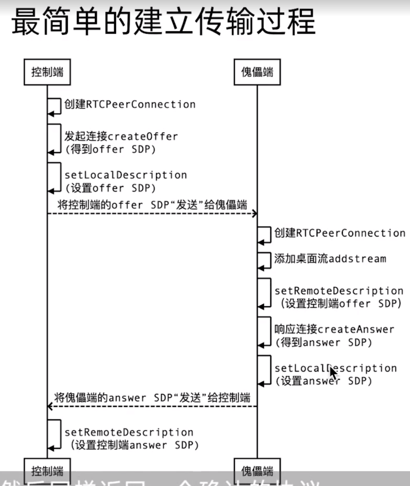

# Electron demo of remote control
- From Geekbang [Tutorial](https://time.geekbang.org/course/detail/100044201-191151)

# WebRTC 介绍
- Web Real-Time Communications，web实时通信技术。简单地说就是在web浏览器里面引入实时通信，包括音视频通话等。
- 由3个主要模块组成
  - 获取本地媒体（getUserMedia()，MediaStream API）
  - 在浏览器和对等端（其它浏览器或终端）之间建立对等连接（RTCPeerConnection API）
  - RTCDataChannel: 传输数据
    - 将媒体和数据通道关联至该连接
    - 交换会话描述（RTCSessionDescription）
- SDP(Session Description Protocol)
  - https://zhuanlan.zhihu.com/p/519937412


# robotjs
- The only Node.js first Desktop Automation Library
- 响应控制指令


# IPC - Inter-Process Communication | 进程间通信
```
渲染进程请求+主进程响应(获取自己的控制码): ipcRenderer.invoke + ipcMain.handle
主进程推送(告知状态): webContents.send + ipcRenderer.on
渲染进程发起请求(申请控制): ipcRenderer.send + ipcMain.on
```

# 端口说明
- app\renderer\pages\control -- 控制端
- app\renderer\pages\main -- 傀儡端

# RTCPeerConnection业务流程
- 傀儡端申请被控制端控制
- 控制端开启p2p连接: createOffer -> setLocalDescription -> 发送SDP给傀儡端 -> 监听 ontrack 事件（等待傀儡端返回的track）
- 傀儡端开启录屏, 获取视频流 -> 响应p2p连接 createAnswer(addTrack -> setRemoteDescription -> setLocalDescription) -> 发送answer给控制端
- 控制端设置 setRemoteDescription -> 监听到 track 事件 -> 获取携带的数据



# P2P难题
- NAT网络地址转换充斥着网络
- 如何获得真是的ip和端口

# NAT打洞(STUN)业务流程
- 控制端通过 onIceCandidate 向 STUN 获取 IceEvent, 发送给傀儡端
- 傀儡端通过 addIceCandidate 把控制端的 IceEvent 添加到 ICE代理中
- 傀儡端通过 onIceCandidate 向 STUN 获取 IceEvent, 发送给控制端
- 控制端通过 addIceCandidate 把控制端的 IceEvent 添加到 ICE代理中
- P2P建立成功

# 说明
- RTCPeerConnection业务
  ```
  RTCPeerConnection是WebRTC API提供的核心组件，用于建立点对点连接，实现实时音视频通信。其业务流程可分为以下几个步骤：
  1. 建立 RTCPeerConnection 对象：应用程序调用RTCPeerConnection构造函数创建一个RTCPeerConnection对象，用于点对点通信。 
  2. 添加流：调用RTCPeerConnection对象的addStream方法将音视频媒体流添加到连接中。
  3. 创建SDP：交换SDP描述文件，开始建立通信信道。对于任务端来说，主动创建SDP，而对于服务端来说，根据本地配置已经设置的SDP。
  4. 交换SDP：使用websocket等技术将SDP描述文件传递给对方。
  5. 创建ICE候选：借助STUN和TURN服务器与远端设备进行通信，收集本地网络信息，生成自己的ICE Candidate。  
  6. 交换 ICE候选：同SDP一样，将本地生成的所有ICE Candidate发送给远程设备。这个步骤是为了将各自的网络信息汇集到一起，呈现在对方设备上，以便对方后续的选择。
  7. 建立P2P通信链路：根据本地生成的ICE Candidate，远程设备通过ICE Agent在自己保存的ICE Candidate中找到自己最匹配的，建立起连接。
  8. 数据通信：连接成功后，对于双向的视频或音频数据传输，可以通过RTCPeerConnection的createDataChannel方法创建数据通道，实现点对点文本、二进制和文件传输等功能。
  总的来说，RTCPeerConnection的业务流程比较繁琐，但是在底层抽象和封装的基础上，能够很好地实现点对点通信。然而，在实际开发中，开发者通常会选择一个基于WebRTC的开源框架，例如EasyRTC、SimpleWebRTC等，这些框架的核心是对RTCPeerConnection的封装。使用这些框架可以大大简化开发过程。
  ```
- NAT打洞
  ```
  NAT打洞指的是通过网络地址转换（NAT）的方式，让两个不在同一局域网内的设备之间建立直接的P2P（点对点）连接，从而可以直接进行数据传输。
  在使用NAT技术的网络环境中，每个设备都被分配一个私有IP地址。这些私有IP地址无法直接从公网访问，因为它们位于NAT后面。此时，如果两个设备要进行直接的P2P通信，就需要利用NAT打洞的技术来建立一个直接的连接。
  NAT打洞的基本原理是，在网络中找到一个公共节点，通过这个公共节点来进行数据的中转和传输。常见的打洞技术有UDP打洞和TCP打洞。
  UDP打洞通常需要借助一个公共的STUN服务器来进行中转，而TCP打洞则需要借助一个公共的可访问的服务器，称之为Relay服务器。
  需要注意的是，NAT打洞虽然可以实现P2P通信，但实现难度比较大，因为每个NAT设备的行为都可能不同，有些可能不支持或支持有限的打洞技术。同时，打洞的成功率也受限于网络环境的复杂程度，因此需要选择合适的打洞技术和策略，如重试机制等。
  ```
- 信令服务
  ```
  信令服务是指在网络通信过程中，用于协调不同节点之间通信的控制信号的传输服务。它通过交换和传播协议消息，使不同节点之间建立对等连接，并对数据包进行路由和转发。
  在实际的通信过程中，不同的节点可能使用不同的协议、格式和编码来传输数据，但是信令服务可以为它们提供一个通用的协议和规范，让它们能够相互协调和配合，实现互通。信令服务主要是建立和维护通信连接的控制信号（如ICE和SDP协议等），而传输数据是由其他服务来实现的（如TCP或UDP传输协议等）。
  在WebRTC中，信令服务主要是用于建立点对点连接，协调双方设备之间的媒体协议信息，并在需要的时候交换网络地址信息，以便建立传输通道。它通常使用WebSocket或HTTP协议完成消息传递。由于WebRTC要求点对点通信必须使用信令服务，因此信令服务对WebRTC实现的稳定性、安全性、低延迟等方面有重要影响。
  常见的WebRTC信令服务有Google的带有STUN和TURN服务器的信令服务、Twilio的信令服务、Sinch的信令服务等。同时还有一些开源的信令服务器如WebSocket-Node，它们为开发者提供了一些开箱即用的解决方案。
  ```
- Electron 中 ipcMain.on 和 ipcMain.handle 有什么区别
  ```
  在 Electron 中，ipcMain.on 和 ipcMain.handle 都是用于处理主进程接收来自渲染进程的 IPC 通讯事件的方法，它们的区别在于：

  1. ipcMain.on 用于监听渲染进程发送过来的事件，并在事件触发时对其进行处理。它的语法为：ipcMain.on(channel, listener)。其中，channel 表示事件的名称，listener 表示事件触发时需要执行的回调函数。该回调函数接收两个参数：event 和 args，分别表示事件对象和事件附带的参数。

  2. ipcMain.handle 则用于注册可被渲染进程调用的方法，并在被调用时返回一个 promise 对象，表示调用结果。它的语法为：ipcMain.handle(channel, listener)。其中，channel 表示方法的名称，listener 表示方法被调用时需要执行的回调函数。该回调函数接收两个参数：event 和 args，分别表示事件对象和方法接收的参数。

  因此，前者是一种事件监听的模式，后者则是一种函数调用的模式。在使用上，可以根据实际情况选择使用哪种模式。如果需要响应事件或推送信息，则使用 ipcMain.on，如果需要提供一个可供渲染进程调用的方法，则使用 ipcMain.handle。
  ```
- ipcMain.on 和 ipcMain.handle 可以相互替代吗
  ```
  在 Electron 中，ipcMain.on 和 ipcMain.handle 不能完全替换彼此。

  首先，它们所处理的事件类型不同。ipcMain.on 用于处理一次性事件，而 ipcMain.handle 用于注册一个前后端通用的方法，可以连续多次被渲染进程调用。

  其次，它们的语法也有所区别。ipcMain.on 方法需要指定事件名称(channel)和回调函数(listener)，而 ipcMain.handle 方法需指定方法名称(channel)和方法回调函数(listener)。
  在 ipcMain.on 的回调函数中，可以通过 event.sender.send() 主动向渲染进程发送消息。
  而在 ipcMain.handle 的回调函数中，则需要返回一个值或 Promise 对象，作为方法调用者获取该方法执行结果的返回值。

  最后，它们的使用场景也有所不同。一般情况下，我们应该优先使用 ipcMain.on 方法处理一次性消息，特别是需要向渲染进程主动推送消息的场景。
  而对于一些需要在渲染进程和主进程之间传递数据和执行方法的场景，我们则使用 ipcMain.handle 方法。

  综上所述，如果你想从主进程中收到单个响应，比如一个方法调用的结果， 请考虑使用 ipcRenderer.invoke 来调用 ipcMain.handle 注册的方法。
  如果你不需要回复此消息，请考虑使用 ipcRender.send 来触发 ipcMain.on 监听的事件
  ```